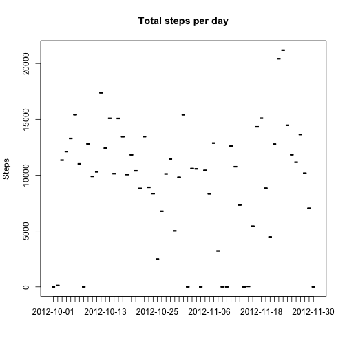
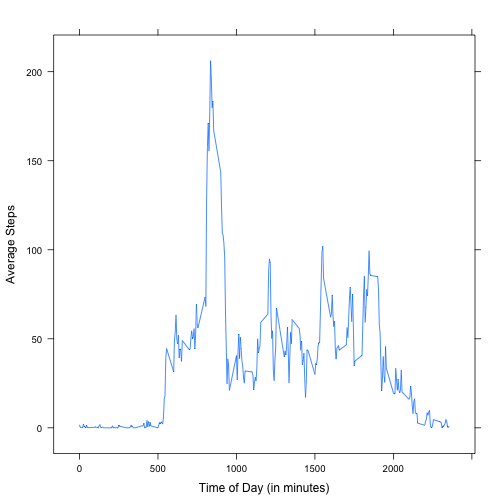
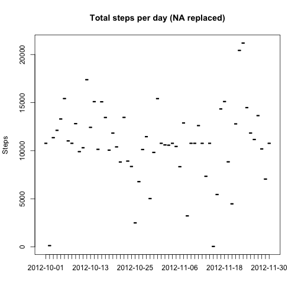
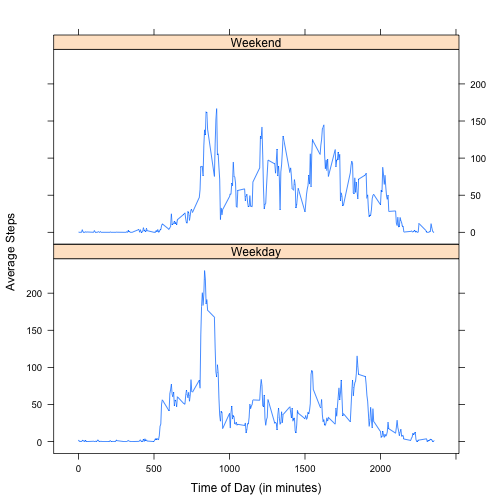

# Reproducible Research: Peer Assessment 1


## Loading and preprocessing the data

Read in the data and load necessary libraries


```r
activity <- read.csv("./activity.csv")
library(plyr)
library(reshape2)
library(lattice)
```


## What is mean total number of steps taken per day?

Here is a histogram of the total number of steps taken each day.
 

```r
daily <- ddply(activity, .(date), summarise, dailysum = sum(steps, na.rm = TRUE))
plot(daily$date, daily$dailysum, type = "h", main = "Total steps per day", ylab = "Steps", 
    xlab = "")
```

 


Mean number of steps taken per day:

```r
mean(daily$dailysum)
```

```
## [1] 9354
```

 
Median number of steps taken per day:

```r
median(daily$dailysum)
```

```
## [1] 10395
```


## What is the average daily activity pattern?

Here is a time series plot of the 5-minute interval and the average number of steps taken, averaged across all days (y-axis) 


```r
averageactivity <- ddply(activity, .(interval), summarise, intervalmean = mean(steps, 
    na.rm = TRUE))

xyplot(intervalmean ~ interval, data = averageactivity, type = "l", xlab = "Time of Day (in minutes)", 
    ylab = "Average Steps")
```

 


The start time (measured in minutes since 12:00 AM) of the interval which, on average across all the days in the dataset, contains the maximum number of steps is: 


```r
averageactivity$interval[averageactivity$intervalmean == max(averageactivity$intervalmean)]
```

```
## [1] 835
```


## Imputing missing values

The presence of missing days may introduce bias into some calculations or summaries of the data.

The total number of missing values in the dataset is:

```r
sum(is.na(activity$steps))
```

```
## [1] 2304
```


Creating a new dataset where each NA value is replaced with the mean for the corresponding 5 minute interval:


```r
filledactivity <- activity

for (i in 1:length(filledactivity$steps)) {
    if (is.na(filledactivity$steps[i])) {
        filledactivity$steps[i] <- averageactivity$intervalmean[averageactivity$interval == 
            filledactivity$interval[i]]
    }
}
```


Repeating the per day analysis using the imputed dataset, first the number of steps taken per day:


```r
filleddaily <- ddply(filledactivity, .(date), summarise, dailysum = sum(steps, 
    na.rm = TRUE))
plot(filleddaily$date, filleddaily$dailysum, type = "h", main = "Total steps per day (NA replaced)", 
    ylab = "Steps", xlab = "")
```

 


The mean and median steps per day have increased because the calculation no longer includes days with 0 total steps due to NA values, notably the mean has shifted much more than the median and now has the same value.
  
Mean number of steps taken per day:

```r
mean(filleddaily$dailysum)
```

```
## [1] 10766
```

 
Median number of steps taken per day:

```r
median(filleddaily$dailysum)
```

```
## [1] 10766
```


## Are there differences in activity patterns between weekdays and weekends?

To answer this question a new factor variable is inserted into the imputed dataset flagging whether a given date is a weekeday or not.


```r
filledactivity$weekday <- as.factor("Weekday")
levels(filledactivity$weekday) = c("Weekday", "Weekend")

for (i in 1:length(filledactivity$steps)) {
    if (weekdays(as.Date(filledactivity$date[i])) == "Saturday" | weekdays(as.Date(filledactivity$date[i])) == 
        "Sunday") {
        filledactivity$weekday[i] <- "Weekend"
    }
}
```


In order to analyse the average daily activity for weekdays versus weekends the interval average for each kind of day must be calculated. Melting and recasting the dataframe will be the easiest way to do this.


```r
daytypeactivity <- filledactivity[, c("interval", "weekday", "steps")]

meltactivity <- melt(daytypeactivity, id = c("interval", "weekday"))
daytypeaverage <- dcast(meltactivity, interval + weekday ~ variable, mean)
```


The following panel plot shows the different average activity for weekdays and weekends, allowing the activity to be compared.  


```r
xyplot(steps ~ interval | weekday, data = daytypeaverage, type = "l", layout = c(1, 
    2), xlab = "Time of Day (in minutes)", ylab = "Average Steps")
```

 

